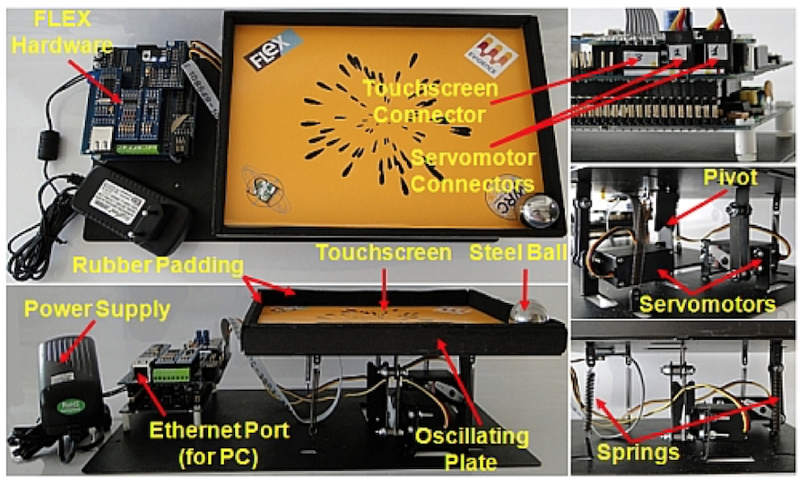

# gym-AmazingBallSystem

| [Explore the Amazing Ball System Docs 📖](https://cs-people.bu.edu/rmancuso/courses/cs454_654-sp22/docs.php) | [Request Feature 💻](https://github.com/samsilverman/gym-AmazingBallSystem/issues) |
|--------------------|-------------------|



OpenAI gym environment for the Amazing Ball System used in [CS454/654: Embedded Systems Development](https://cs-people.bu.edu/rmancuso/courses/cs454_654-sp22/) (Spring 2022).

### Built With

gym-AmazingBallSystem was built with:

* [OpenAI Gym](https://www.gymlibrary.ml/#)

## Getting Started

These instructions will get you a copy of the gym environment up and running on your local machine.

### Prerequisites

You will need to install the following software gym-AmazingBallSystem:

* [Conda](https://docs.conda.io/en/latest/)

### Installation

1. Clone the repository.

    ```bash
    git clone https://github.com/samsilverman/gym-AmazingBallSystem.git
    ```

2. Create the conda environment.

    ```bash
    conda env create --file gym_abs.yml
    ```

3. Activate the conda environment.

    ```bash
    conda activate gym_abs
    ```

    **NOTE**: To deactivate the environment, run:

    ```bash
    conda deactivate gym_abs
    ```

## Usage

Use gym-AmazingBallSystem like any other OpenAI gym.

```python
import gym
from amazing_ball_system_env import AmazingBallSystemEnv
env = AmazingBallSystemEnv()
observation = env.reset()
for _ in range(1000):
   action = policy(observation)  # User-defined policy function
   observation, reward, done, info = env.step(action)

   if done:
       observation = env.reset()
env.close()
```

## Contribute

Contributions are what make the open-source community such an amazing place to learn, inspire, and create. Any contributions you make are **greatly appreciated**.

If you have a suggestion that would make this better, please fork the repo and create a pull request. You can also simply open an issue with the tag "enhancement". Don't forget to give the project a star! Thanks again!

1. Fork the project.

2. Create your feature branch.

    ```bash
    git checkout -b feature/AmazingFeature
    ```

3. Commit your changes.

    ```bash
    git commit -m 'Add some AmazingFeature'
    ```

4. Push to the branch.

    ```bash
    git push origin feature/AmazingFeature
    ```

5. Open a pull request.

## Contact

Sam Silverman - [@sam_silverman](https://twitter.com/sam_silverman) - [sssilver@bu.edu](mailto:sssilver@bu.edu)

## Acknowledgements

* [Best README Template](https://github.com/othneildrew/Best-README-Template)

gym-AmazingBallSystem was used in a final project for the course [CS454/654: Embedded Systems Development](https://cs-people.bu.edu/rmancuso/courses/cs454_654-sp22/) taught by Prof. Renato Mancuso.

Original Project Team:

* [Sam Silverman](https://github.com/samsilverman)
* [Justin Sayah](https://github.com/justin-sayah)
* [Joe Biernacki](https://www.linkedin.com/in/jwbiernacki)
